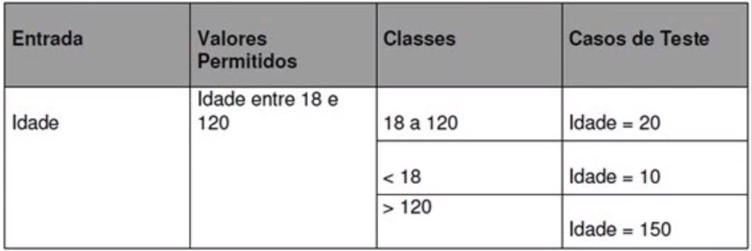

## Testes unitários e TDD com PHP e PHPUnit

### Material do curso
https://www.udemy.com/testes-unitarios-php-phpunit/

## Instruções

Clone o projeto:

`git clone git@github.com:viniciuswebdev/curso-php-phpunit.git`

#### Parte 1

Para executar os testes da `parte 1` basta acessar o diretório:

`cd curso-php-phpunit/parte_1`

E executar os testes:

`php run_tests.php`

#### Parte 2

Para executar os testes da `parte 2` siga as seguintes instruções:

 Acesse o diretório do projeto:
 
`cd curso-php-phpunit/parte_2`

 Instale as dependências:
 
`./composer.phar install`

 Execute os testes:
 
`./vendor/bin/phpunit src/`

#### Commands PHP
```bash
composer init
composer dump
composer dumpautoload
composer require --dev phpunit/phpunit ^8
vendor\bin\phpunit --version
vendor\bin\phpunit testes/
vendor\bin\phpunit --colors testes/
```
#### Testes Automatizados

Estrutura padrão para iniciar um teste:

* `Arrange(Organizar) - Given(dado)`
    * Criação dos pré-requisitos (cenário) para realizar os testes automatizados sejam executados.
* `Act(Agir) - When(Quando)`
    * Execução do código que será testado.
* `Assert(Afirmar) - Then(Então)`
    * Verificar se a saída é a esperada.

A tarefa do teste é dar um feedback rápido e claro sobre a corretude do código.

Classes de Equivalencia

Similaridades entre os casos de testes (cenarios)

Analise de valor de limite ou fronteira



#### Key Words

* testes manuais
* testes automatizados
* testes unitarios
* testes de integração
* TestCase
* Data Providers
* Dublê de teste

#### NOTES

Injeção de dependencia ajuda a a ter um codigo mais modularizado, essa tecnica passamos as dependencias no construtor de um objeto.

O conceito de dublê de testes é um objeto que se parece com outro, para a realização de testes mais isolados.

Testes Unitarios e testar as classes de forma isolada

Nomenclaturas para testes

`shouldBeValidWhenValueIsANumber` ou `whenValueIsANumberShouldBeValid`

* `O que esta sendo testado?`
* `Quais as circunstancias?`
* `Qual o resultado esperado?`

Pode ser usado _ (underscore) para separar o nome

Testar Entidades?
`NOTE:` Metodos que possuem regras de negocio estes devem ser testados.

#### Stubs

Testes Unitarios e testar as classes de forma isolada

O que fazer quando uma classe tem muitas dependencias?

O principio da responsabilidade unica também se aplica para testes

a solução usando PHPUnit e usar stubs, que é um objeto com um comportamento fixo e previsivel, ou seja, um objeto falso muito semelhando ao objeto real so que sem funcionalidade so retorna os valores fixos.

Stubs foca na classe que sera testada e simular as dependencias.

#### Mocks

Mocks faz a mesma coisa que um Stub diferenciando na possibilidade de fazer a asserção do comportamento.
Um cenario para ser utilizado e quando temos metodos que não retornam nada e precisamos de asserção no comportamento do objeto.
Garantindo que ele vai chamar um metodo ou não.


#### Fakes, Dummies e Spies

`Fakes:` Fakes tem a funcionalidade da classe real é ela só e usada nos testes. Usado em fake de databases e APIs para representação da comunicação com estes serviços.

`Dummies:` são objetos que criamos no test, onde não precisamos especificar nenhum retorno para ele e nenhum tipo de asserção de comportamento. Ele só e criado para satisfazer algum parametro de uma classe ou metodo.

`Spies:` Tem o mesmo objetivo dos Mocks que e fazer asserção de uma chamada de metodo, so que em vez de fazer uma asserção no comportamento do objeto e feita a asserção pelo estado do objeto.

#### PHPUnit

TestCase
Data Providers
Metodos setUp e tearDown

Com o metodo `createMock` conseguimos ter uma classe pronta para ser utilizada como um dublê de testes.

Para criar expectativas sobre dublês, ou seja, garantir que determinados métdos sejam realmente chamados com uso do `expects`.

Para personalizar o nosso `mock`, utilizamos o método `getMockBuilder`

Dublês podem propositalmente lançar uma exceção.
Toda vez em que chamamos um metodo que pode ser lançada uma exceção o dublê usa o metodo `willThrowException` pode ser chamado.

Com o metodo `with` podemos verificar quais argumentos foram passados para um metodo.

Podemos capturar argumentos passados para método dos nossos mocks e fazer verificações neles com `willReturnCallback`.

Métodos estáticos dificultam a geração de testes, já que não podemos fazer a injeção de dependencias.

`setUp:` É um metodo protected retorna void e sempre e executando antes dos testes.
 - Método executado antes de cada teste da classe
```
public function setUp(): void
```

`tearDown:`
 - Método executado após cada teste da classe 
 Ele a bastante utilizado em tests de integração banco de dados, socket, sistema de arquivos.
```
public function tearDown(): void
```

`setUpBeforeClass:`
 - Método executado uma vez só, antes de todos os testes da classe
 Bastante usado para teste de integração
```
public static function setUpBeforeClass(): void
```

`tearDownAfterClass:`
 - Método executado uma vez só, após todos os testes da classe
```
public static function tearDownAfterClass(): void
```

* [PHPUnit Fixtures](https://phpunit.readthedocs.io/en/8.1/fixtures.html)

Configurações no XML do PHPUnit

```xml
<phpunit
        xmlns:xsi="http://www.w3.org/2001/XMLSchema-instance"
        xsi:noNamespaceSchemaLocation="https://schema.phpunit.de/6.3/phpunit.xsd"
        colors="true">
    <testsuites>
        <testsuite name="unit">
            <directory>tests</directory>
        </testsuite>
    </testsuites>
    <logging>
        <log type="testdox-text" target="testes-executados.txt"/>
    </logging>
</phpunit>
```

* [PHPUnit config file](https://phpunit.readthedocs.io/pt_BR/latest/configuration.html)

Caso uma refatoração quebre um código, os testes irão nos dizer imediatamente, facilitando a correção. Ao refatorar um código testado, temos a segurança de que não estamos gerando um comportamento indesejado.

`baby steps:` que basicamente consiste em avançar o nosso software de forma gradual.

`TDD` o Test Driven Development

Que o TDD define um ciclo de desenvolvimento guiado pelo teste:
* `Escreva` um teste, que ainda não vai passar
* `Implemente` a funcionalidade, que faz o teste passar
* `Refatore` (melhoramos, simplificamos) o código

Que o TDD ajuda que tenhamos um teste para cada funcionalidade
* Ele também documenta e simplifica classe

Que devemos implementar a funcionalidade em pequenos passos, chamados de baby steps, sempre guiados pelos testes

#### Exceções

O PHPUnit fornece um metodo chamado expectedException com o qual podemos informar que determinado código precisará lançar uma exceção e que tipo de exceção é essa, por exemplo uma DomainException.

```php
$this->expectException(\DomainException::class);
$this->expectExceptionMessage('O campo nome não pode ser vazio!');
```

## Testes de Integração

Testes de integração testam além do nosso código
 * Testa a integração entre várias classes/módulos da aplicação
 * Podem testar a integração com um sistema externo
    * SGBD
    * APIs
    * Requests HTTP para o próprio sistema

Em banco de dados transações(transactions) são aliadas para realizar operações SQL em testes.
O SQLite fornce um banco de dados em memória que pode auxiliar na performance da suite de testes.
Mas limitado a insert, select, update e delete. Operações mais sofisticadas como triggers, procedures, etc não e recomendado pois cada SGDB possui suas peculariedades.

Testes Intermediarios (Asserts Intermediarios)

Commands:
* `vendor/bin/phpunit --testsuite=unit`
* `vendor/bin/phpunit --testsuite=integration`

`Tests com POSTMAN:`
```javascript
pm.test("Código de status da resposta deve ser 200", () => {
    pm.response.to.have.status(200);
});

pm.test("Resposta deve estar em JSON", () => {
    pm.response.to.be.json;
});

const leiloes = pm.response.json();
pm.test("Resposta deve estar no formato válido de leilões", () => {
    const schema = {
        required: ['descricao', 'estaFinalizado'],
        properties: {
            descricao: {
                type: "string",
            },
            estaFinalizado: {
                type: "boolean"
            }
        }
    };

    leiloes.forEach(leilao => pm.expect(tv4.validate(leilao, schema)).to.be.true);
});

pm.test("Nenhum leilão deve estar finalizado", () => {
    leiloes.forEach(leilao => pm.expect(leilao.estaFinalizado).to.be.false);
});
```


#### Referencias

* [Arrange Act Assert](https://wiki.c2.com/?ArrangeActAssert)
* [GivenWhenThen](https://martinfowler.com/bliki/GivenWhenThen.html)
* [Principles for Test-Driven Development](https://integralpath.blogs.com/thinkingoutloud/2005/09/principles_of_t.html)
* [PHPUnit](https://phpunit.de/getting-started/phpunit-9.html)
* [PHPUnit Assertions](https://phpunit.readthedocs.io/en/8.1/assertions.html)
* [Tecnicas de Teste](http://testwarequality.blogspot.com/p/tenicas-de-teste.html)
* [Mocks aren't Stubs](https://martinfowler.com/articles/mocksArentStubs.html)
---
* [Transactions DBs](http://luizricardo.org/2014/02/o-que-sao-e-como-funcionam-transacoes-em-sql/)
* [The Challenge of Distributed Database Systems](http://berb.github.io/diploma-thesis/community/061_challenge.html#61)